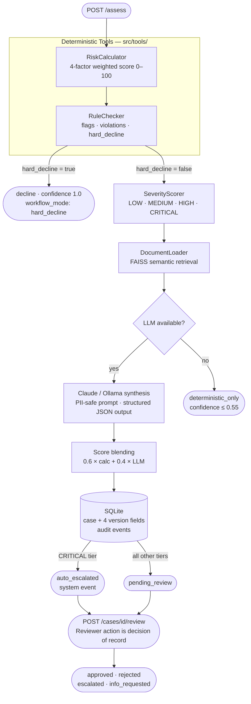

# Insurance AI Decision Workflow

An insurer-facing workflow system that takes an insurance submission from intake to a human-reviewed, fully auditable underwriting decision.

This is not a RAG assistant. This is not an autonomous AI system.  
This is a **structured workflow** where the model recommends and the reviewer decides — and every step is versioned and auditable.

---

## How it works



---

## What the system proves

| Question | Where answered |
|----------|---------------|
| Where does information come from? | `insurance-nlp-aws` pipeline → FAISS index → `src/ingestion/document_loader.py` |
| What deterministic checks run? | `RiskCalculator` + `RuleChecker` — fully reproducible, versioned at `rules_version` |
| How is the recommendation produced? | Weighted blend of deterministic score + LLM synthesis — `src/workflow/orchestrator.py` |
| How does a human review it? | `POST /cases/{id}/review` — approve / reject / escalate / request_info |
| What is stored? | Every case in SQLite with PII hashed — `data/workflow.db` |
| What is versioned? | `model_version`, `prompt_version`, `rules_version`, `kb_version` — four fields on every case |
| How are failures handled? | `workflow_mode` is always declared: `full`, `deterministic_only`, or `hard_decline` |

---

## Quick start

```bash
# 1. Clone and create environment
git clone <repo-url>
cd insurance-ai-decision-workflow
python -m venv .venv && .venv\Scripts\activate    # Windows
# python -m venv .venv && source .venv/bin/activate  # Linux / macOS

# 2. Install dependencies
pip install -r requirements.txt

# 3. Configure
cp .env.example .env
# Edit .env — set ANTHROPIC_API_KEY, or set LLM_PROVIDER=none for deterministic-only mode

# 4. (Optional) Build or refresh the FAISS index
#    cd ../insurance-nlp-aws && python run_pipeline.py --local
#    cp insurance_faiss.index ../insurance-ai-decision-workflow/data/
#    cp insurance_metadata.json ../insurance-ai-decision-workflow/data/

# 5. Start the API
uvicorn src.api.main:app --host 0.0.0.0 --port 8000 --reload
```

Interactive docs: `http://localhost:8000/docs`

---

## Sample: submit and review a case

### Step 1 — Submit an assessment

```bash
curl -X POST http://localhost:8000/assess \
  -H "Content-Type: application/json" \
  -H "X-API-Key: your-api-key" \
  -d '{
    "policyholder_id": "PH-20240112-0041",
    "age": 34,
    "annual_income": 72000,
    "credit_score": 715,
    "policy_type": "auto",
    "premium_amount": 1800,
    "claims_history": [
      { "date": "2024-08-15", "amount": 3200.00, "type": "collision" }
    ],
    "policy_start_date": "2026-05-01"
  }'
```

**Response**

```json
{
  "case_id": "b3a2f891-4c10-4e9a-a847-16f2c3d85e01",
  "request_id": "f09c1aa3-9b2e-4d11-8cfe-5e7a2bc14d22",
  "recommendation": "refer",
  "rationale": "Risk score is low-moderate. One recent collision claim under the high-severity threshold. Credit is preferred tier. Refer for standard underwriting review.",
  "confidence": 0.71,
  "risk_score": 38.5,
  "risk_level": "Low",
  "severity_tier": "MEDIUM",
  "severity_estimated_cost": 12400.0,
  "severity_note": "Priority review. Estimated cost $5k–$25k; may require additional documentation.",
  "evidence_refs": ["DOC_014", "DOC_022"],
  "rule_flags": ["recent_claims_present", "good_credit", "medium_income"],
  "rule_violations": [],
  "compliance_score": 100,
  "hard_decline": false,
  "llm_available": true,
  "workflow_mode": "full",
  "latency_ms": 1840,
  "versions": {
    "model_version": "claude-haiku-4-5-20251001",
    "prompt_version": "v1.1",
    "rules_version": "v1.0",
    "kb_version": "faiss-2025-05-05"
  },
  "timestamp": "2026-05-10T14:23:07Z"
}
```

### Step 2 — Reviewer approves

```bash
curl -X POST http://localhost:8000/cases/b3a2f891-4c10-4e9a-a847-16f2c3d85e01/review \
  -H "Content-Type: application/json" \
  -H "X-API-Key: your-api-key" \
  -d '{
    "reviewer_id": "underwriter_jane",
    "action": "approve",
    "notes": "Single prior collision, within exposure limit. Income and credit verified. Approved at standard rate."
  }'
```

### Step 3 — Export audit log

```bash
curl -H "X-API-Key: your-api-key" http://localhost:8000/audit/export
# Returns JSONL; PII fields appear as sha256:... or [REDACTED]
```

---

## API reference

| Method | Path | Description |
|--------|------|-------------|
| `POST` | `/assess` | Run full workflow; creates a case |
| `GET`  | `/cases` | List cases (filter by `?status=`) |
| `GET`  | `/cases/{id}` | Full case detail with all audit fields |
| `POST` | `/cases/{id}/review` | Submit reviewer decision |
| `GET`  | `/cases/{id}/history` | Ordered audit event log for a case |
| `GET`  | `/audit/export` | Full audit log as JSONL (PII redacted) |
| `GET`  | `/health` | Subsystem status — retrieval, severity mode, LLM provider |
| `GET`  | `/versions` | Current version manifest |

Full request / response schemas: [docs/api_contract.md](docs/api_contract.md)

---

## Workflow modes

`workflow_mode` is present in every assessment response. It declares exactly what ran — there is no silent degradation.

| Mode | When | Confidence ceiling |
|------|------|-------------------|
| `full` | LLM available and ran successfully | Up to 1.0 |
| `deterministic_only` | LLM unavailable or failed | Capped at 0.55 |
| `hard_decline` | Eligibility rule fired; LLM not consulted | Fixed at 1.0 |

---

## Severity tiers and routing

| Tier | Estimated cost | Automatic action |
|------|----------------|-----------------|
| `LOW` | < $5,000 | Standard review queue |
| `MEDIUM` | $5k – $25k | Priority review |
| `HIGH` | $25k – $100k | Specialist reviewer required |
| `CRITICAL` | > $100k | Auto-escalated to senior underwriter on case creation |

`CRITICAL` cases receive `status: escalated` at creation. The escalation is recorded as an `auto_escalated` audit event with `actor: system`.

---

## Related repositories

| Repo | Role |
|------|------|
| [`insurance-nlp-aws`](../insurance-nlp-aws) | Ingestion and extraction — PDF ETL, NER, FAISS index build, AWS deployment |
| [`claims-severity-prediction`](../claims-severity-prediction) | Severity model — fine-tuned LoRA/QLoRA adapter for `SeverityScorer` |

The interface between `insurance-nlp-aws` and this repo is two files: `insurance_faiss.index` and `insurance_metadata.json`.  
See [docs/ingestion_boundary.md](docs/ingestion_boundary.md) for the full boundary specification.

---

## Documentation

| Document | Contents |
|----------|---------|
| [docs/architecture.md](docs/architecture.md) | Seven-layer system diagram, layer reference, data flow, version fields |
| [docs/api_contract.md](docs/api_contract.md) | Full endpoint schemas, status codes, behavioral constraints, examples |
| [docs/business_case.md](docs/business_case.md) | Problem statement, KPIs, compliance alignment, scope boundaries |
| [docs/operations.md](docs/operations.md) | Deployment, environment variables, health monitoring, runbooks |
| [docs/governance.md](docs/governance.md) | Human role boundary, PII policy, versioning policy, failure mode transparency |
| [docs/severity.md](docs/severity.md) | Severity scoring tiers, routing logic, model vs. rule-based mode |
| [docs/ingestion_boundary.md](docs/ingestion_boundary.md) | Interface specification with `insurance-nlp-aws` |
| [eval/report.md](eval/report.md) | Evaluation results — 15 cases, 5 categories, known failure modes |
| [CHANGELOG.md](CHANGELOG.md) | Release history with rule and prompt version tracking |
