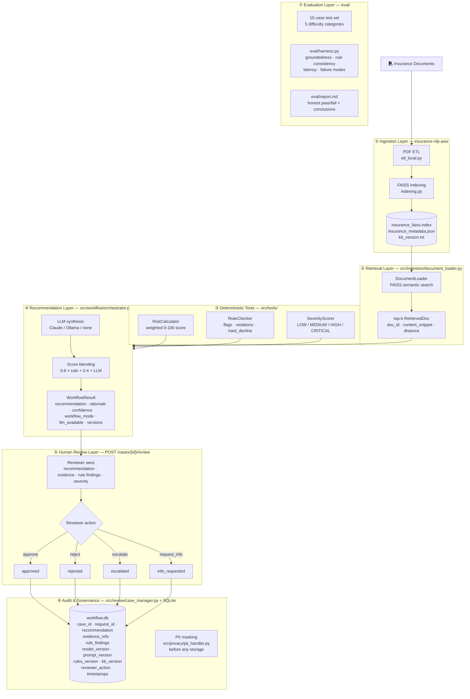

# System Architecture

## Overview

The Insurance AI Decision Workflow is a seven-layer system. Each layer has
a defined owner (file/module), a defined input, a defined output, and a
version that appears in every audit record.



---

## Layer reference

### ① Ingestion (companion repo: insurance-nlp-aws)

| Item | Value |
|------|-------|
| Owner | `insurance-nlp-aws/scripts/etl_local.py` + `indexing.py` |
| Input | Raw PDF insurance documents |
| Output | `insurance_faiss.index`, `insurance_metadata.json`, `kb_version.txt` |
| Version | `kb_version` — set at index-build time |
| Rebuild | `python run_pipeline.py --local` in the insurance-nlp-aws repo |

### ② Retrieval

| Item | Value |
|------|-------|
| Owner | `src/ingestion/document_loader.py` |
| Input | Free-text query built from policyholder profile |
| Output | `list[RetrievedDoc]` — doc_id, content_snippet, distance |
| Version | Inherits `kb_version` from the loaded index |
| Degraded mode | Returns `[]` with `retrieval.available = false` in `/health` |

### ③ Deterministic Tools

| Component | Owner | Output | Version |
|-----------|-------|--------|---------|
| RiskCalculator | `src/tools/risk_calculator.py` | `score: float`, `level: str`, `breakdown: dict` | `rules_version` |
| RuleChecker | `src/tools/rule_checker.py` | `flags`, `violations`, `hard_decline: bool` | `rules_version` |
| SeverityScorer | `src/severity/severity_scorer.py` | `tier`, `estimated_cost_usd`, `mode` | model path or rule-based |

### ④ Recommendation

| Item | Value |
|------|-------|
| Owner | `src/workflow/orchestrator.py` |
| Input | Outputs of layers ②③ |
| Output | `WorkflowResult` — recommendation, rationale, confidence, scores, versions |
| LLM providers | Anthropic Claude (primary), Ollama (alternative), none (deterministic_only) |
| Blending | `final_score = 0.6 × calc_score + 0.4 × llm_score` (when LLM available) |

### ⑤ Human Review

| Item | Value |
|------|-------|
| Endpoint | `POST /cases/{case_id}/review` |
| Actions | `approve`, `reject`, `escalate`, `request_info` |
| Terminal states | `approved`, `rejected` — cannot be updated after |
| Decision of record | Reviewer action, not model recommendation |

### ⑥ Audit & Governance

| Item | Value |
|------|-------|
| Storage | SQLite `data/workflow.db` (WAL mode, thread-safe) |
| PII treatment | `policyholder_id`, `annual_income`, `credit_score` hashed before write |
| Minimum fields | case_id, request_id, recommendation, evidence_refs, rule_findings, 4 version fields, reviewer_action, timestamps |
| Export | `GET /audit/export` → JSONL |

### ⑦ Evaluation

| Item | Value |
|------|-------|
| Test set | `eval/dataset/cases.json` — 15 cases across 5 categories |
| Harness | `eval/harness.py` — runs all cases, scores each dimension |
| Report | `eval/report.md` — results, failure modes, safe/unsafe conclusions |

---

## Data flow: one request end-to-end

```
POST /assess
  │
  ├─ RiskCalculator.calculate(data)       → score=72.4  level=High
  ├─ RuleChecker.check_all(data)          → flags=["poor_credit"]  violations=["credit_below_threshold"]
  ├─ SeverityScorer.score(data)           → tier=HIGH  estimated=$48k
  ├─ DocumentLoader.retrieve(query, k=4)  → [DOC_001, DOC_003, DOC_007]
  ├─ LLM.complete(system, user_msg)       → recommendation=refer  confidence=0.71
  ├─ blend_scores(72.4, None, violations) → final_score=72.4  level=High
  │
  ├─ CaseManager.create_case(...)         → case_id=uuid  status=pending_review
  │   └─ pii_handler.mask_for_storage()  → policyholder_id=sha256:...
  │
  └─ Return AssessmentResponse
       case_id, recommendation, risk_score, severity_tier,
       evidence_refs, rule_violations, llm_available,
       workflow_mode, versions, timestamp

POST /cases/{case_id}/review
  │
  ├─ CaseManager.submit_review(case_id, approve, reviewer_id)
  │   └─ status: pending_review → approved
  │   └─ audit_events: [case_created, review_submitted]
  │
  └─ Return updated Case
```

---

## Version fields on every case

```json
{
  "model_version":  "claude-haiku-4-5",
  "prompt_version": "v1.0",
  "rules_version":  "v1.0",
  "kb_version":     "faiss-2025-05-05"
}
```

Increment policy: see [governance.md](governance.md#3-versioning-policy).
